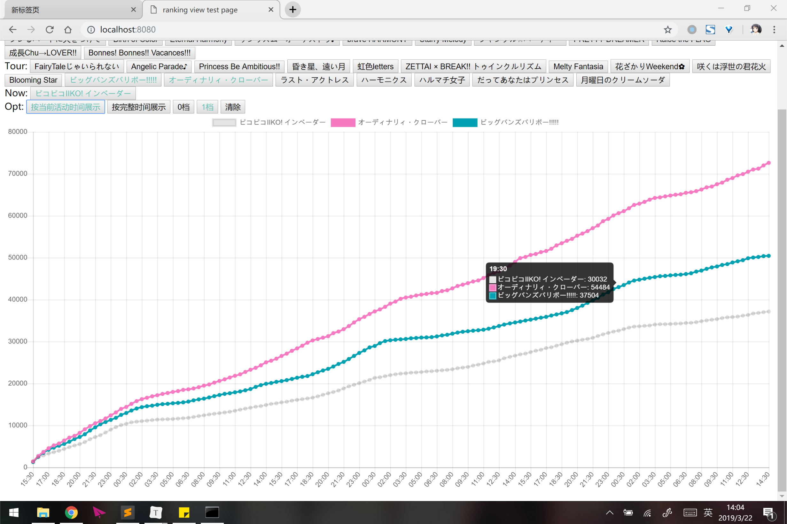

# ミリシア PST ranking view

偶像大师百万现场剧场时光 pst活动 排名数据表（好别扭的名字



## 代码结构

main.py 相关数据爬虫

index.html 主页

data/xx.json 活动数据

events.json 全部活动名称

## TODO

- [ ] 实时更新方案
- [ ] 优化界面
- [ ] 完善功能（时间段展示，相近档次提醒？......）
  - [x] 展示时间调整
  - [x] 0/1档切换

## TIP

```bash
# 临时测试用server
# python2
python -m SimpleHTTPServer 8080
# python3
python -m http.server 8080
```