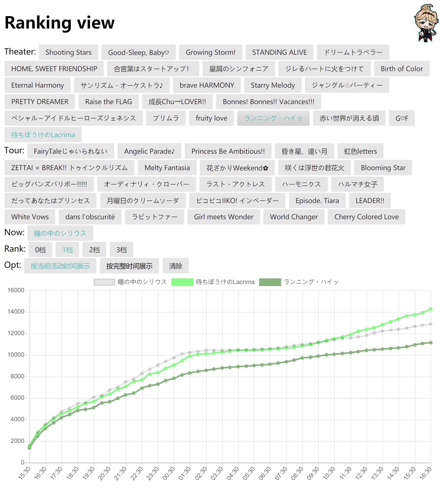

# ミリシア PST ranking view

Data source: [Princess API](https://api.matsurihi.me/docs/) 夢の世界へご招待なのです

Public RESTful Application Programming Interface Series.

万分感谢这么优秀无私的有能同担，给大家提供了巨大的便利。



该服务主要提供了多活动的比对，方便初略的观察与预测。

从api里获取得数据，有部分遗漏或前后变化，在作者另一个api里又有部分补充。我对往期数据进行了汇总。能获得到真实数据的，尽量填补了，部分遗失数据用前后时刻平均得到。

~~放在国内的cdn上了，需要的朋友也可以适量使用。~~被gank了，服务目前挂在某国内轻量应用服务器上，也有可能随时被gank，之后考虑备案一下。

## 代码结构

- index.html 主页
- 数据脚本相关
  - getEventData.py 爬取活动ranking数据相关
  - main.py 主程序入口，更新events.json，调用getEventData.py
  - log.py 日志维护
- 其他目录与数据
  - events.json 活动信息数据
  - data 活动数据目录
  - qnlib 七牛云相关api接口调用的代码
    - 目录下编辑config-bak.py 另存为config.py
  - utils 一些零碎脚本目录

## TODO

- [ ] 优化界面(时间提醒？)
- [x] ~~爬取数据后自动上传cdn~~
- [x] 时间对齐（因为有部分漏的数据）
- [x] 服务器部署与自动更新

## ~~API 接口~~

~~/rank_v1912/events_list.json~~

~~活动汇总与id~~

~~/rank_v1912/[eid].json~~ 

~~eid 为活动id（不会有当前活动的）~~

~~由于是手动维护的，这个更新可能有所延迟~~

## TIP

```bash
# 临时测试用server
# python2
python -m SimpleHTTPServer 8080
# python3
python -m http.server 8080
```